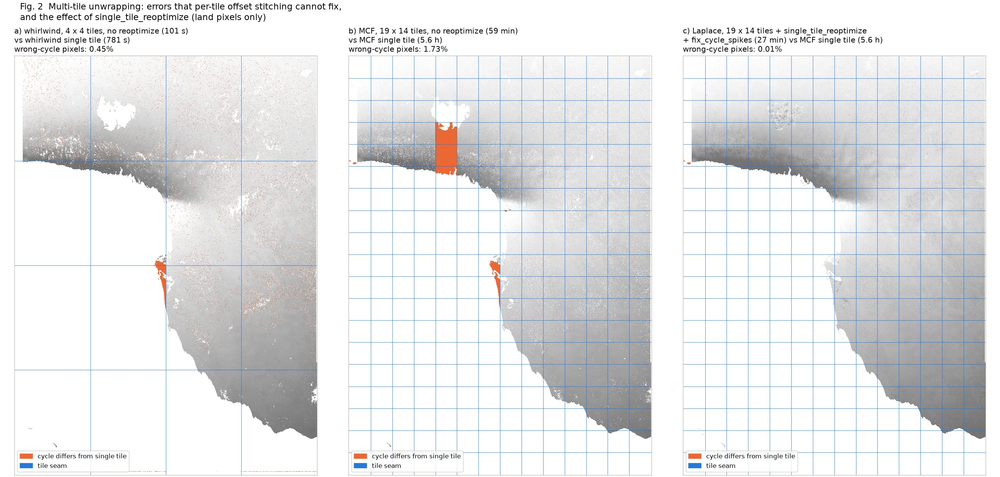
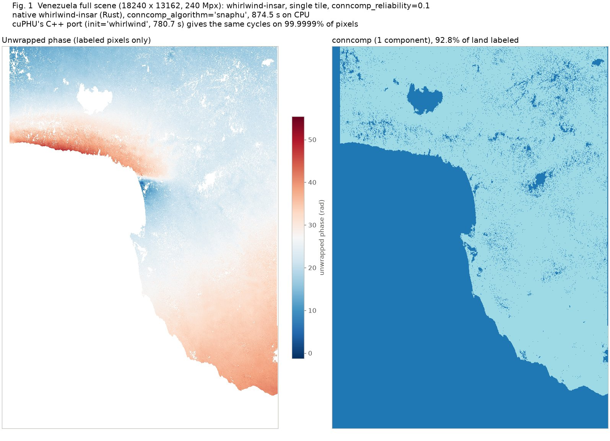
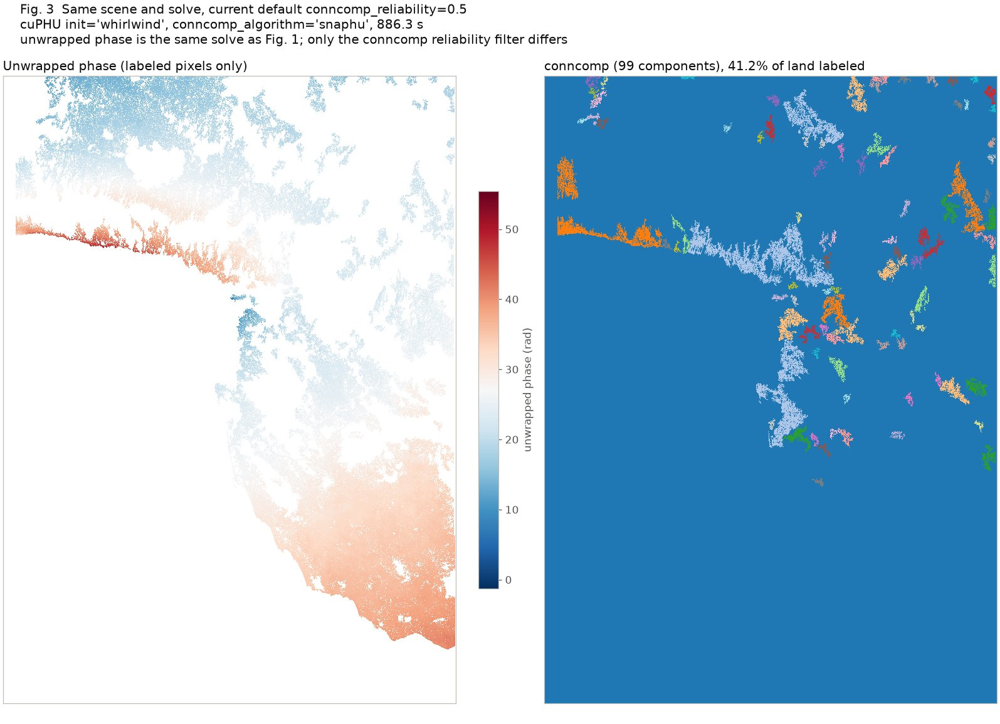

# cuPHU project summary (September 2026)

**Status: development has ended.** I recommend [whirlwind-insar](https://github.com/scottstanie/whirlwind-insar) for NISAR/ISCE3 phase unwrapping; see [§4](#4-decision-end-cuphu-development-in-favor-of-whirlwind). cuPHU stays available as-is for reference.

I developed cuPHU as a GPU-accelerated phase unwrapper for InSAR processing, unaware at the time that whirlwind-insar existed. After testing both, I recommend whirlwind and have stopped developing cuPHU.

cuPHU has a SNAPHU-compatible, snaphu-py-style Python API, and it is wired into ISCE3 on the [`cuphu` branch of earthdef/isce3](https://github.com/earthdef/isce3/tree/cuphu). This page covers:
- the unwrapping algorithms and how they were ported
- benchmark results, including a 240 Mpx NISAR scene
- the limitations of multi-tile unwrapping
- why development ended in favor of whirlwind
- connected-component reliability settings for the whirlwind path

## 1. Unwrapping algorithms in cuPHU and how they were ported

cuPHU exposes four solvers through one `init=` argument.

- **MCF: a port of SNAPHU/MCF.** SNAPHU's C source is included directly. Everything that scales with pixel count runs as GPU kernels:
  - wrapped gradients and box-car averaging
  - the statistical smooth/defo cost
  - phase integration
  - connected-component labeling

  The network-flow solve itself (CS2 `MCFInitFlows` plus `TreeSolve`) stays on the CPU. A thread-local copy of the CS2 state lets tiles solve concurrently in `nproc` threads. After fixing two sign-convention bugs, MCF matches snaphu-py to 0.008% (Afar) and 0.001% (Nevada) integer-cycle disagreement. The residuals are all at coherence below 0.2, where costs are tied.

  A GPU push-relabel replacement for `MCFInitFlows` was also prototyped. It was correct but about 300× slower than CPU CS2 at practical tile sizes, so that line of work was closed.

- **MST: a port of SNAPHU/MST.** Not validated.

- **Laplace: a new GPU-only method.** It has no CPU counterpart. MCF and Laplace both minimize a misfit of the same form, between the unwrapped phase gradient and the measured wrapped gradient $g_{ab}$ on each pixel pair (arc) $(a,b)$:

  $$E_p(u) = \sum_{(a,b)} w_{ab}\,\lvert u_b - u_a - g_{ab}\rvert^p$$

  - **$p = 1$ (L1) is Costantini's minimum-cost-flow problem.** Network flow solves it exactly, and the result is automatically an integer number of cycles away from the wrapped input. SNAPHU's MCF solves a generalization of it, with coherence-based statistical costs in place of the plain weighted $\lvert\cdot\rvert$.
  - **$p = 2$ (L2) is the classical weighted least-squares unwrapping of Ghiglia & Romero (1994) and Ghiglia & Pritt (1998).** Setting the gradient to zero gives a linear system $L\,u = b$. Here $L$ is the coherence-weighted graph Laplacian of the pixel grid, a discrete Poisson equation $\nabla^2 u = \nabla\cdot g$, hence the name "Laplace". With uniform weights, Ghiglia & Pritt solve it directly with a fast cosine transform. Coherence weights break that shortcut, so cuPHU solves it iteratively on the GPU with Jacobi-preconditioned conjugate gradient (CG).

  The drawback of L2 is that it spreads the error around each residue smoothly across the scene instead of concentrating it on a few arcs, so it flattens large-scale trends and loses whole fringes. **IRLS (iteratively reweighted least squares)** recovers the L1 answer using only L2 solves. After each solve, every arc's weight is divided by the size of its current misfit $e_{ab}$:

  $$w_{ab} \leftarrow \frac{w^0_{ab}}{\sqrt{e_{ab}^2 + \delta^2}}$$

  A squared error weighted this way behaves like $w^0_{ab}\,\lvert e_{ab}\rvert$, which is the L1 cost. Arcs with large misfit are down-weighted, so the next solve piles the error onto them, much as MCF places its 2π jumps. cuPHU runs 16 such passes, each warm-started from the previous one, while $\delta$ is annealed from 0.5 to 0.01 rad (large at first for a well-conditioned system, then small to sharpen the jumps). A final step rounds each pixel to the nearest integer number of cycles from the wrapped phase.

  Laplace's known weakness is "smoothness bleeding": a wrongly unwrapped, weakly connected feature pulls good neighboring pixels to the wrong value during the solve itself. Only a network-flow re-solve (`single_tile_reoptimize`) repairs this.

- **Whirlwind: a from-scratch C++ port of whirlwind-insar's `unwrap_linear`.** It covers the whole pipeline:
  - Carballo/Costantini cost
  - capacity-1 network with soft masking
  - primal-dual passes plus a successive-shortest-path solve using Dial's bucket-queue Dijkstra
  - both conncomp algorithms (`linear`, and `snaphu` with cut thickening)

  The port is bit-exact against native whirlwind-insar on a 22.5 Mpx crop of a Venezuela scene. On the full 240 Mpx scene it agrees on 99.9999% of pixels. Only the cost lookup table runs on the GPU, and that is under 2% of runtime. About 88% of the time is the sequential shortest-path search. The GPU cannot speed that up, because the cost comes from searches that must sweep far across the graph, not from many independent small tasks.

cuPHU also ships optional post-processing:
- `single_tile_reoptimize`
- native phase bridging (`bridge=True`), which reconciles whole-cycle offsets between regions a mask splits apart. It is a GPU/C++ port of ISCE3's bridging algorithm:
  - region labeling, erosion and boundary extraction run on the GPU
  - each region's boundary is capped at `bridge_max_boundary_samples` points
  - a grid-based nearest-region search on the GPU replaces all-pairs KD-tree queries, so the cost stays low on heavily fragmented scenes
  - the bridge tree and per-bridge medians are computed on the CPU, with optional ramp removal (`bridge_ramp_type`)
- `reference_pixel` alignment

It handles these kinds of masks:
- **Any user-supplied valid-pixel mask** (`mask=`, bool or uint8, where 0 means invalid). MCF, MST and Laplace treat masked pixels as hard exclusions. The whirlwind path follows whirlwind-insar's soft masking: masked arcs are free to cross during the solve and are blanked afterwards.
- **Water masks** from a water-distance raster, via `cuphu.build_water_mask()`, in two conventions:
  - NISAR's convention (0 = land, 1–100 = distance from the coastline, 101–200 = 100 + distance from inland water), with separate `ocean_water_buffer` and `inland_water_buffer`
  - any nonzero-is-water raster, with a uniform `water_buffer` in pixels
- **NISAR subswath masks.** In the ISCE3 workflow, `mask_type: ['water', 'subswath_mask']` combines the water mask with the RIFG subswath mask (pixels invalid in either the reference or the secondary image), plus an optional external `mask_path` raster.
- **Mask buffering** (`mask_buffer`, 64 px by default). The solve runs through a slightly grown valid region, so narrow valid features at a mask edge don't become isolated, and the original mask is restored for the output.
- **Invalid values in the input.** NaN or infinite pixels in the interferogram or coherence are zeroed and so carry no weight, and near-zero-coherence arcs get effectively zero weight in the cost.

## 2. Benchmarks

**Small scenes** (RTX 4060 laptop GPU, 8-core CPU; snaphu-py 2.0.7 with identical arguments):

| Scene | Configuration | Wall time | Speedup vs snaphu-py 1 tile | Cycle disagreement |
|---|---|---:|---:|---:|
| NISAR Afar 1283×999 | snaphu-py, 1 tile | 22.9 s | 1.0× | reference |
| | snaphu-py, 2×2, nproc=4 | 11.2 s | 2.0× | |
| | cuPHU MCF, 1 tile | 10.9 s | 2.1× | 0.008% |
| | cuPHU MCF, 3×3, nproc=9 | 1.3 s | 17.6× | |
| | cuPHU Laplace, 1 tile | 4.6 s | 5.0× | 0.30% |
| S1 Nevada 1847×3498 | snaphu-py, 1 tile | 258 s | 1.0× | reference |
| | snaphu-py, 3×3, nproc=9 | 180 s | 1.4× | |
| | cuPHU MCF, 3×3, nproc=9 | 14 s | 19.1× | 0.00% |
| | cuPHU Laplace, 1 tile / 3×3 | 51 s / 39 s | 5.1× / 6.6× | 0.02% / 0.25% |

**Full scene: NISAR Venezuela RIFG, 18240×13162 = 240 Mpx, nlooks = 7.43** (server with an RTX PRO 6000 Blackwell GPU and 64 logical CPU cores):

| Configuration | Wall time | Speedup vs MCF 1 tile | Wrong-cycle pixels vs same-algorithm single tile |
|---|---:|---:|---:|
| cuPHU MCF, 1 tile (reference) | 20,236 s (5.6 h) | 1.0× | reference |
| cuPHU MCF, 19×14 tiles, no reoptimize | 3,562 s (59 min) | 5.7× | 1.73% |
| cuPHU MCF, 4×4, nproc=16, no reoptimize | 4,831 s (81 min) | 4.2× | 0.11% |
| cuPHU Laplace, 19×14 + reoptimize + `fix_cycle_spikes` | 1,175–1,619 s (20–27 min) | 12–17× | 0.01% vs MCF 1 tile (27-min run) |
| cuPHU Laplace, 4×4, no reoptimize | 192 s | 105× | 23.6% vs MCF 1 tile (see §3) |
| **whirlwind-insar (native Rust), 1 tile, CPU** | **874.5 s (14.6 min)** | **23×** | reference |
| cuPHU whirlwind port, 1 tile, CPU | 780.7 s (13.0 min) | 26× | 0.0001% vs native |
| cuPHU whirlwind port, 4×4, nproc=16, no reoptimize | 101.3 s | 200× | 0.45% |

The mask configurations differ between rows:
- The single-tile MCF reference used an ocean mask.
- The 19×14 MCF run was unmasked.
- The whirlwind and 4×4 runs used the RIFG subswath/water mask, which does not remove the open ocean.

So whirlwind's single-tile time was measured on the *harder* problem, with the ocean left in.

Three conclusions follow.
- **The GPU helps less than hoped.** For MCF, a single tile on the GPU is only about 1.3–2.1× faster than snaphu-py, mostly from GPU cost computation and an early-exit check. Almost all of cuPHU's large speedups come from tiling, and tiling brings the correctness problems described in §3.
- **Single-tile whirlwind is already fast.** On the CPU with no tiling, it unwraps the full 240 Mpx scene 23× faster than single-tile MCF. It is also faster than every tiled cuPHU configuration that has been made exact with `single_tile_reoptimize`.
- **These results agree with whirlwind-insar's own [NISAR comparison](https://github.com/scottstanie/whirlwind-insar/blob/main/docs/NISAR_SUMMARY.md).**

## 3. Multi-tiling and its limitations

cuPHU's tiling solves overlapping tiles independently in parallel. It then stitches them by finding each adjacent pair's median whole-cycle offset in the overlap band and propagating those offsets across the tile grid. This is exact when every tile's valid area is a single connected piece. On the Venezuela scene it fails in three ways:

- **A region disconnected inside its own tile (Fig. 2a, b).** A narrow coastal strip is attached to the mainland only across the central tile seam. Inside its own tile it is an island, so its cycle count is arbitrary, and stitching applies one offset to the whole tile. That strip (~316k px) ends up on the wrong cycle. This happens in whirlwind 4×4 (0.45%), MCF 4×4, and MCF 19×14 alike. The problem is the tiling, not any one solver.
- **Tiles mis-registered where overlaps carry little coherent signal (Fig. 2b).** In MCF 19×14, a column of tiles along the coast (1.8 Mpx) is shifted by a whole cycle.
- **Errors inside a tile's solve (Laplace only).** Without reoptimize, Laplace 4×4 takes 192 s but puts 23.6% of land pixels on the wrong cycle compared with single-tile MCF. Whole tile-shaped blocks are wrong, because smoothness bleeding corrupts the solve inside a tile, and no choice of stitching offset can repair that. Laplace 19×14 plus `single_tile_reoptimize` takes 27 min and brings the disagreement down to 0.08%. The remainder is mostly 15 isolated rows that are one cycle off, a defect of the network-flow re-solve itself. `fix_cycle_spikes` corrects them in about 3 s, which leaves 0.01% (Fig. 2c).

*Fig. 2. Multi-tile runs on the Venezuela scene. Orange marks pixels whose cycle count differs from the single-tile solution; blue lines mark tile seams. (a) whirlwind 4×4, no reoptimize, 101 s. (b) MCF 19×14, no reoptimize, 59 min. (c) Laplace 19×14 plus `single_tile_reoptimize` and `fix_cycle_spikes`, 27 min. Panels (b) and (c) are compared with single-tile MCF (5.6 h).*

A further drawback: per-tile conncomp labels are not merged across seams. Whirlwind 4×4 gives 113 components where single tile gives 1–2.

The first two failure modes are whole-cycle offsets of connected regions. In principle, a cheap **region-level stitching** could fix most of them: register each tile's connected components against its neighbors separately, instead of one offset per tile. cuPHU currently relies on **`single_tile_reoptimize`** instead, which is a full-scene CPU network-flow re-solve seeded from the stitched result.
- For MCF and Laplace, the seed makes the re-solve cheaper (Laplace plus reoptimize takes 20–27 min).
- For whirlwind, which always solves from scratch, it costs about as much as a single-tile solve. On the 22.5 Mpx crop, 2×2 tiles plus reoptimize took 124 s versus 62 s for a single tile, bit-identical. That cancels the tiling gain. A full-scene whirlwind 4×4 plus reoptimize run was started but not completed.

Because single-tile whirlwind is already fast enough at full-scene size, the simplest correct setup is to not tile at all.

## 4. Decision: end cuPHU development in favor of whirlwind

- The expensive part of every network-flow unwrapper (CS2, `TreeSolve`, and whirlwind's shortest-path solve) is sequential. Two separate investigations found no profitable GPU path for it. The parallel parts are already on the GPU and are a small share of the time.
- Getting speed from tiling requires `single_tile_reoptimize` to be correct, which adds complexity and brings back the full-scene cost.
- Single-tile whirlwind on the CPU:
  - beats all exact cuPHU configurations
  - needs no GPU
  - uses less memory
  - is maintained upstream by its author
- Keeping a separate C++ port of whirlwind inside cuPHU would duplicate that upstream effort.

cuPHU stays available as-is, together with the ISCE3 `cuphu` branch. Its validation results and notes remain as a reference, including the SNAPHU-exact GPU MCF path. No further development is planned. One item is worth carrying over to whirlwind: region-level tile stitching, if tiling is ever needed.

## 5. Connected-component reliability (whirlwind)

For `init='whirlwind'` with `conncomp_algorithm='snaphu'`, the connected components are a reliability filter on the solved phase. The threshold can be set in two ways:
- **`conncomp_reliability`**, in inverse-variance ($1/\sigma^2$) units. It defaults to 0.5, matching whirlwind-insar's Python default.
- **`conncomp_min_coherence`**, a target minimum coherence that overrides `conncomp_reliability`. It is converted with the Just/Bamler phase-noise model, $1/\sigma^2 = 2L\gamma^2/(1-\gamma^2)$ for $L$ looks. `'auto'` uses $\gamma = 0.32/\sqrt{L}$, the setting in ISCE3's NISAR defaults, which gives a reliability of about 0.21 at any number of looks.

Results at 0.5 and 0.1 on the Venezuela scene come from the same solve and differ only in the conncomp post-pass, so the unwrapped phase is identical:

| `conncomp_reliability` | Full scene: components | Full scene: land labeled | 5000×4500 crop: components | Crop: labeled |
|---:|---:|---:|---:|---:|
| 0.5 (Fig. 3) | 99 | 41.2% | 154 | 21.5% |
| 0.1 (Fig. 1) | 1 | 92.8% | 8 | 49.3% |

At 0.1, the reliable islands merge into one component covering almost all land, while decorrelated water stays unlabeled even without an ocean mask (0.13% of ocean pixels labeled). At 0.5, most land is left unlabeled, split into 99 separate components. The threshold only affects a cheap post-pass, so runtime is the same.

*Fig. 1. Single-tile whirlwind-insar on the Venezuela scene with `conncomp_reliability=0.1`: unwrapped phase (left) and connected components (right). 874.5 s on CPU.*

*Fig. 3. The same solve as Fig. 1 with `conncomp_reliability=0.5`, the default.*

---

Detailed notes, validation history, and the technical note are available on request.
